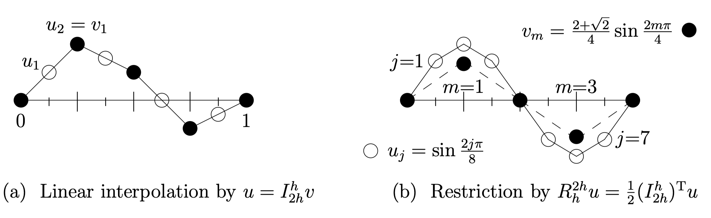
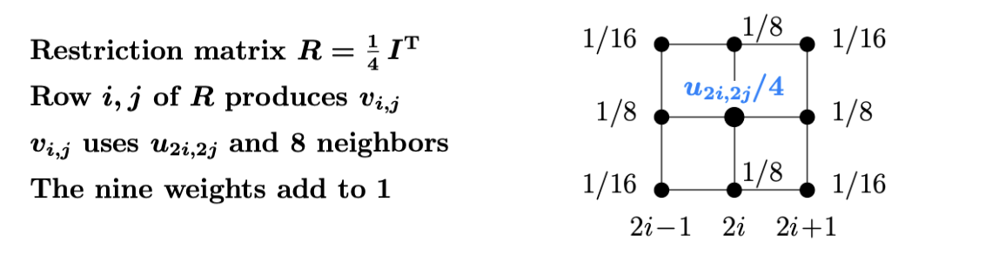
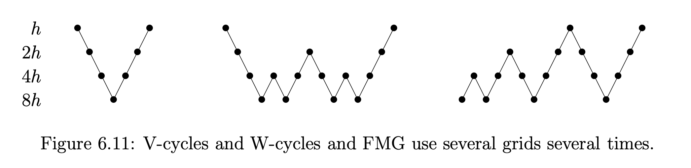

A translation to:  [Chapter 7-3](https://ocw.mit.edu/courses/18-086-mathematical-methods-for-engineers-ii-spring-2006/resources/am63/) of Strang, Gilbert. Computational Science and Engineering

A selfish present to Gilbert Strang.

# Multigrid Methods - 多重网格法

## 背景问题

考虑如下的两点边值问题：
$$
\begin{cases}
	- u''(x) = f(x)\quad \forall x \in (0, 1) \\
	u(0) = u(1) = 0
\end{cases}
$$
我们使用有限差分法进行求解，对于空间采用$N+1$点均匀划分：
$$
x_0 = 0, ..., x_n = i / N, ..., x_N = 1
$$
二阶导数用如下的公式近似：
$$
f(x_j) = u''(x_j) \approx \frac{2u(x_{j}) - u(x_{j-1}) - u(x_{j+1})}{(1/N)^2}
$$
这转化为求解如下的线性方程组求解问题：
$$
\frac{1}{h^2}  \begin{bmatrix}
	2 & -1 & 0 & 0& \cdots & 0\\
	-1 & 2 & -1& 0& \cdots & 0\\
	0 & -1 & 2 & -1& \cdots& 0\\
  0 &  0& -1 & 2& \cdots& 0\\
	\vdots& \vdots&\vdots&\vdots & \ddots & \vdots\\
	0 & 0 & 0 & 0&\cdots & 2
\end{bmatrix} \begin{bmatrix}
	u(x_1)\\u(x_2)\\u(x_3)\\
	\vdots\\
	u(x_{N-1})
\end{bmatrix} = \begin{bmatrix}
	f(x_1)\\f(x_2)\\f(x_3)\\
	\vdots\\
	f(x_{N-1})
\end{bmatrix}
$$
我们将方程组的求解问题写成 $Ax = b$ 的形式。
$$
A = \frac{1}{h^2} \begin{bmatrix}
	2 & -1 & 0 & 0& \cdots & 0\\
	-1 & 2 & -1& 0& \cdots & 0\\
	0 & -1 & 2 & -1& \cdots& 0\\
  0 &  0& -1 & 2& \cdots& 0\\
	\vdots& \vdots&\vdots&\vdots & \ddots & \vdots\\
	0 & 0 & 0 & 0&\cdots & 2
\end{bmatrix}
$$
这是一个稀疏矩阵的求解问题，我们先不考虑使用直接求解器（三对角矩阵有很好的求解方法，但是对于2维的情况，构建出的矩阵不是三对角的），而使用迭代求解器进行求解。

> Note：这里使用有限差分法是可以收敛到精确解的，可以考虑在使用等距网格的情况下的有限元方法，它们诱导了相同的线性方程组求解问题。

我们一般将这里的求解选取的 $x_j, j = 0, ..., N$ 看作一个网格。等距网格的粗细指的是$h=1/N$的大小。越小的$h$能够得到越精确的结果，但求解点数的$N$也会随之上升，计算量随之增大。

## 引入

Jacobi 和 Gauss- Seidel 迭代都能够产生“光滑”的误差：误差向量 $e$ 的高频分量在很少次的迭代后消失，但是低频分量很少衰减。迭代收敛需要$O(N^2)$次，对于实际问题是不可接受的。

> Background：考虑线性方程组 $A x = b$ 的求解，使用迭代求解。
>
> - $x_0$ 为迭代初值；
> - $e_i = A^{-1}b - x_i$，表示当前解与真解的误差；
> - $r_i = Ae_i = b - A x_i$ 表示当前解表达方程组的误差
>
> Multi Grid方法最常见的可以用于求解Poisson问题的解。均匀网格下的有限差分法将这样的Poisson问题变成线性方程组的求解问题。

多重网格法（MultiGrid）可以极大的解决迭代求解器的效率问题，其思想是将原本网格上的线性方程求解问题转化到一个更粗的网格上，在更粗的网格上施用迭代求解器（例如Jacobi/GS求解器），细网格上的低频分量转化为了粗网格上的高频分量，粗网格求解器消除的高频分量实则就是细网格上的低频分量。

> Recall：例如间隔为$\Delta x$的网格上$e^{i\omega \cdot n \Delta x}$ 分量，在$2 \Delta x$ 上对应$e^{i 2 \omega \cdot n \Delta x}$，频率也提升了一倍。

在粗网格上，原本的低频分量很快就被“干掉”了。而且，我们在粗网格上只需要很少次数的迭代，就能够使得这些分量消失。这样的性质使得多重网格法能够使用**固定次数**的迭代，就能较精确地求解现实中很多的稀疏方程组（这里的次数不随着矩阵规模而变大）。

多重网格法一般用于对称的矩阵求解问题。它的最核心要素是用两个矩阵 $R$ 和 $I$ 来在不同的网格上进行切换。

1. **限制矩阵**（Restriction Matrix） $R=R_{2h}^h$ ：把向量从细网格传到粗网格上；
2. **插值矩阵**（Interpolation matrix）$I= I_{2h}^h$：将粗网格上的结果传到细网格上
3. 原始矩阵在粗网格上的近似 $A_{2h}=RA_hI$

> Note：这里用 $h, 2h$ 这样的记号是参考了有限差分求解的网格粗细记号，用来表征从一个粒度为 $h$ 的细网格，和另一个粒度为 $2h$ 的粗网格。

我们先考虑这些矩阵的定义：假设粗网格上有 3 个点，
$$
v = (v_1, v_2, v_3)^T
$$
我们希望得到细网格上的数值，可以用线性插值得到，写成矩阵形式可以得到上面定义的**插值矩阵**如下。注意到$u$ 的2/4/6行恰好是 $v_1, v_2, v_3$，而1/3/5/7行就是从$0, v_1, v_2, v_3, 0$进行的线性插值。另外我们观察$I$矩阵，在奇数行的元素值为 $1/2$，这样很容易计算，我们也几乎只用 $h, 2h, 4h, …$ 这样的网格。使用别的插值方法也是可行的，但是线性插值易于实现。
$$
\underbrace{\frac{1}{2} \begin{bmatrix}
	1 & & \\
	2 & & \\
	1 & 1 & \\
		& 2 & \\
		& 1 & 1\\
		&   & 2\\
		&		& 1
\end{bmatrix}}_{I = I_{2h}^h}
\begin{bmatrix}
v_1\\
v_2\\
v_3
\end{bmatrix} = \begin{bmatrix}
	0/2 + v_1 / 2\\
	v_1\\
	v_1/2 + v_2 / 2\\
	v_2\\
  v_2/2 + v_3 / 2\\
	v_3\\
	v_3/2 + 0 / 2
\end{bmatrix} = \begin{bmatrix}
  u_1\\
  u_2\\
  u_3\\
  u_4\\
  u_5\\
  u_6\\
  u_7\\
\end{bmatrix}
$$

> Note：利用两点边值问题的边界条件。

考虑 $v$ 是粗网格上的一个谐波，尽管$v$可能是粗网格上的高频分量，但它对应了细网格上的低频分量，我们的插值操作能够将它很好地反映在细网格上。

> Note：这一段说的有点奇怪，简而言之就是，在细网格上的任何一个**低频误差分量**都能在粗网格上有一一的体现。（Recall：高频误差分量都能够被迭代求解器很好的处理）

反过来，我们可以从细网格限制到粗网格上（类似于一个“平均”）。它将$u$从一个细网格传递到粗网格上。一种可能的是直接令 $v_i=u_{2i+1}$，这样就忽略了$u_{2i}$的影响。我们可以用一种加权平均的方法，下面的公式说明了这个方法（Full weighting operator）。
$$
\begin{bmatrix}
v_1\\
v_2\\
v_3
\end{bmatrix} =\underbrace{\frac14\begin{bmatrix}
	1 & 2 & 1 &\\
	&&1 & 2 & 1\\
	&&&& 1 & 2 & 1
\end{bmatrix}}_{R_h^{2h} = \frac{1}{2} (I_{2h}^h)^T} \begin{bmatrix}
  u_1\\
  u_2\\
  u_3\\
  u_4\\
  u_5\\
  u_6\\
  u_7\\
\end{bmatrix}
$$
限制矩阵将细网格的低频分量的频率翻倍传递到粗网格上，画出图像更好理解这个过程：



## 二维空间中的插值和限制矩阵

二维空间中，粗网格到细网格的插值是通过双线性插值得到。双线性插值可以通过$x, y$两个方向上分别进行线性插值得到。

**水平方向的插值**：
- $u_{2i, 2j} = v_{i, j}$
- $u_{2i, 2j + 1} = \frac 1 2 (v_{i, j} + v_{i, j+1})$

**竖直方向的插值**：
- $u_{2i +1, 2j} = (v_{i, j} + v_{i+1, j}) / 2$
- $u_{2i +1, 2j+1} = (v_{i, j} + v_{i+1, j} + v_{i, j+1} + v_{i+1, j+1}) / 4$

我们不给出插值算子 $I2D$ 的矩阵形式。

> Recall：有限维线性空间到有限维线性空间的线性映射，选取一个合适的基的情况下可以表达为一个矩阵。

反过来，从细网格到粗网格的算子 $R2D = \frac{1}{4} I2D^T$（$1/4$的常数使得$1 \rightarrow 1$）。这个矩阵的稀疏由 $\frac{1}{4} ,\frac{1}{8} ,\frac{1}{16}$组成，每一个粗网格点都是对于细网格的9点加权平均：



其实你不难发现这些稀疏的由来，原本一维情况下加权平均系数是$(\frac14, \frac12, \frac14)$。$R2D$在这一个局部上的系数正是这个小的向量的外积。而$R2D$正是$R$与自身的Kronecker Product。

> Note：考虑 3x3 的网格和，标号为
> ```
> 1 2 3
> 4 5 6
> 7 8 9
> ```
> 它拍平后为
> ```
> 1 2 3 4 5 6 7 8 9
> ```
> Kronecker积恰好对应了这样的变换。简单验证下，$R$为3x7的矩阵，$R2D$ 是 9x49 的矩阵，维数也是相对应的。

> Recall：矩阵的 Kronecker 积对应了 Tensor Product

现在，我们能够在网格之间相互传递向量，这就是几何理解的多重网格法，我们能在网格基于间距h，2h和4h的情况下进行计算。这个想法可以延伸到三角形元素（每个三角形自然地分成四个三角形）。实际计算的几何形状可以比我们在一个正方形网格考虑的模型更加复杂。

当几何上的多重网格变得较为复杂，或者我们只是获得了一个矩阵，而没有相应的“网格”概念，这是我们可以使用Algebraic multigrid（AMG）。它也是基于多尺度求解的思想，可以直接应用在$Ax = b$问题上，而不依赖于具体的网格。

## 两个网格的 V-Cycle（v-cycle）

> Jacobi Iteration:
> $$
> x_{n+1} =  D^{-1}(b - R x_n)\quad \text{where}\quad A = D + R
> $$

我们先考虑只使用两个网格进行求解的过程。在每个网格内的迭代，我们考虑使用 Jacobi 格式或者GS格式求解。我们前面多次指出，对于一个较大规模的问题，在细网格上的迭代法对于低频误差去除得很慢（也就是原文说的“对于精确解的低频分量收敛很慢”）。多重网格法将细网格的残差$r_h = b - A u_h$传到粗网格上$r_{2h}$；然后在粗$2h$网格上求解$A_{2h} E_{2h} = r_{2h}$；然后将$E_{2h}$传到细网格上为 $E_h$，并且修正 $u'_h = u_h + E_h$，然后再次执行这个流程。

这样的循环就是一个两网格的 V-cycle。我们将其称之为一个 v-cycle（小v），以下是它的步骤（残差是指 $r_h=A_h (u - u_h) = b_h - A_h u_h$）：

1. **Iterate**（迭代）：在细网格上迭代，求解 $A_h u_h = b_h$（例如使用3次的Jacobi或GS迭代）
2. **Restrict**（限制）：将残差传递到粗网格上，$r_{2h} = R_h^{2h} r_h$
3. **Solve**（求解）：在粗网格上迭代，求解修正项 $A_{2h} E_{2h} = r_{2h}$（例如，从$E=0$开始3次迭代，在更进一步的方法中，这个方程的求解方法是任意的）
4. **Interpolate**（插值）：修正项从粗网格上传到细网格上，$E_h = I_{2h}^h E_{2h}$，将 $E_h$ 加到 $u_h$ 上
5. **Iterate**（迭代）：以  $u_h + E_h$（消除了部分低频分量）为初值迭代，类似第一步的过程

> Note：
>
> - 残差$r$是指模型观测值与真实值的误差，模型观测值指的是 $Ax$，真实值就是 $b$，$r = b - Ax$
> - 误差$e$是指当前解和真实解的误差，$e = A^{-1} b - x$
> - 误差和残差相比，要求知道真实解的值（知道真解的值时，已经解决了矩阵求解问题）但残差只需要计算$b-Ax$，这里面每一项都是已知的。
>
> 我们希望修正项 $E_h = I_{2h}^h E_{2h}$ 能够尽可能好的表达 $e_h$，即 $E_h \approx e_h$，这样：
>
> $$
> \begin{aligned}
> 	&u_h +  I_{2h}^h E_{2h} \approx u_h + e_h = A^{-1}b\\
> 	\implies & A_hI_{2h}^{h} E_{2h}\approx b - A_hu_h = r_h\\
> 	\implies & \underbrace{R_{h}^{2h} A_h I_{2h}^h}_{A_{2h}} E_{2h} \approx R_{h}^{2h} r_h
> \end{aligned}
> $$
>
> 上面的最后一步给出了多重网格第三步的解释。

2-3-4 步给出的 **限制-粗解-插值** 过程是多重网格法的核心。回忆我们定义的三个矩阵：
$$
\begin{aligned}
	A &= A_{h} = \text{original matrix}\\
  R &= R_{h}^{2h} = \text{restriction matrix}\\
 	I &= I_{2h}^h = \text{interpolation matrix}\\
\end{aligned}
$$

第三步需要第四个矩阵$A_{2h}$，可以从上面的式子中定义（如下）。 $A_{2h}$是一个比原本的$A_h$更小的方阵。换言之，我们希望将更大的矩阵 $A_h$ **投影**到一个粗网格上。这样的投影由一个相当自然的选择，变分正确（Variationally Correct，不知道翻译的对不对）的 $A_{2h}$ 可以从 $R,A,I$ 直接得到：

$$
A_{2h} = R A I
$$

例如，细网格上有7个数据点，粗网格有3个数据点，我们求得的矩阵恰好是$3\times 3$的。

### 例子

在一维情况下，$A = A_h$ 可能是一个二阶差分矩阵 $K/h^2$。我们之前的例子中，$h=\frac18$，现在为了方便起见，我们考虑 $h = \frac16$ 的情况，这样多重网格法实现在5点和2点的粗细网格上的插值和限制（$I \in \mathbb R^{5\times 2}$，$R\in \mathbb R^{2 \times 5}$）。将$K_5/h^2$代入$RA_h$中可得：
$$
\begin{aligned}
RA &= \frac 1 4 \begin{bmatrix}
	1 & 2 & 1 \\
		& 	& 1 & 2 & 1
\end{bmatrix}
\frac {1} {h^2}
\begin{bmatrix}
	2 & -1 \\
	-1 & 2 & -1 \\
	& -1 & 2 & -1\\
	&& -1 & 2 & -1\\
	&&& -1 & 2
\end{bmatrix}\\
&=
\frac{1}{(2h)^2} \begin{bmatrix}
	0& 2 & 0 & -1 & 0\\
	0& -1 & 0 & 2 & 0\\
\end{bmatrix}
\end{aligned}
$$


对于$A_{2h}$的一个自然的选择是（直接用前文中的插值矩阵$I_{2h}^h$ 代入也是相同的结果）：
$$
A_{2h} = RAI = \frac{1}{(2h)^2} \begin{bmatrix}
	2 & -1\\
	-1&  2
\end{bmatrix}
$$
不难看出，这恰好是$2h$的网格上的二阶差分矩阵（因为网格为$2h$宽，分母自动放大）。

> Note：差分算子K$的定义从两点边值问题的矩阵求解形式中得到。
>
> Recall：之前定义的两点边值问题，Poisson方程（微分方程）被转化为线性方程组（差分方程）。写出网格$h = 1/3$的矩阵，恰好是这里的$A_{2h}$。
>
> Note：我的理解是，用相同的数值方法，但用不同的网格密度求解同一个方程，粗网格的解$u_{2h}$插值到细网格上，应该“接近”细网格的解$u_h$。

我们选取的$R = \frac{1}{2} I^T$还有一个很好的性质：**如果原先的矩阵 $A$ 是对称、正定的，那么$RAI = \frac{1}{2} I^T A I$ 也是对称正定的。**

> 读者自证不难。

$A$的正定性通常由数值方法的推导得到，特别是Galerkin方法中非常常见（有限元法是Galerkin法的代表）。

> Note：对于Poisson 问题的有限元法，
>
> - 除去纯Neumann边值问题，其他的情况下由双线性形式诱导的矩阵都是正定的；
> - 纯Neumann边值问题添加$\int_{\Omega} u \mathrm d x = 0$ 的条件后，诱导的矩阵也是正定的；

尽管第一步和第五部不是多重网格法的核心，但第一步和第五步是必要的：第一步（smoother）将原本误差中的高频分量消除，而第五步（post-smoother）将粗网格插值引入的一小部分高频误差消除。在实现上，各种Jacobi和GS求解器都是可行的。

> Note：这里杂糅了一些自己的理解，原文为
>
> Steps 1 and 5 are necessary, but they are really outside the essential multigrid idea. The **smoother** is step 1, the post-smoother is step 5. Those are normal iterations for which weighted Jacobi or Gauss-Seidel is satisfactory.

## 误差分析

假设在第三步我们精确地求出了粗网格上的误差方程。多重网格误差修正项$E_h$是否能等于
$e_h = u - u_h$呢？这种期望显然是不切实际的！毕竟我们只是在一个粗网格上求解了这个问题，并不是整个问题。但是，在多重网格法中，$E_h$ 和 $e_h$ 之间的联系是最关键的。对 $E_h$ 和$e_h$的分析过程很简单，我们一步一步的来看。

> Note：看之前的步骤部分后面给的一段分析。
> 
> 在这里，方便起见，在不引起歧义的情况下省略了一部分上下标（公式打得我好累）

*作用在$e$上的四个矩阵*：
- 第二步，残差计算涉及了$e$：$r_h = b- A_h u_h = Ae$；
- 第二步，传到粗网格时，限制矩阵作用在其上：$r_{2h} = RA_he$
- 第三步，假设精确地求解$2h$上的方程：$E_{2h} = A_{2h}^{-1}r_{2h} = (RAI)^{-1}R A_h e$
- 第四步，传回细网格，插值矩阵作用在其上，最终形式如下

$$
E = (I A_{2h}^{-1} R A_h) e =: S e
$$

> Note：不能将$A_{2h}^{-1}=(RAI)^{-1}$拆开，这应该很显然。

当 $I \in \mathbb R^{5\times 2}$，$R\in \mathbb R^{2 \times 5}$时，等式右侧的$S$依然是$5\times 5$的矩阵。$S$ 不可能是单位阵/恒等矩阵（Identity Matrix），这是因为$RAI$是$2\times2$的矩阵（$\mathrm{rank}=2$）。但$S$具有性质 $S^2 = S$，**这说明$S$限制在其列空间（Column Space）上是恒等矩阵**。与此同时，在它的零空间（右零空间）上是零矩阵。$S^2 = S$是容易验证的：

$$
S^2 = (I (RAI)^{-1} RA)(I (RAI)^{-1} RA) = I (RAI)^{-1} RA = S
$$

> Note：列空间上恒等的说明。$S$的列空间是说 $\{ Su: u \in \mathbb R^n \}，在列空间中的任一向量 $Su$，因为$S$幂等，所以
> $$
> 	S(Su) = S^2 u = Su
> $$
> 这就说明$S$在列空间上的矩阵是恒等矩阵。

> Note：其实有一个挺常见的结论，矩阵若满足幂等条件 $S^2 = S$，那么$S$是投影矩阵。（并不是正交投影）

因此，多重网格法求出的的修正项 $E = Se$ 并不是整个误差 $e$，而是$e$在$S$的列空间上的投影，修正项和误差之间的差为 $e - E = (I - S)e$。我们将矩阵$I- S$定义为网格算子（原文为Two-Grid Operator，我的翻译水平实在是太烂了）。在分析步骤1、5时，矩阵$M = I - P^{-1}A$起到了重要的作用，而在分析和描述多重网格的步骤2-4时，$I-S$起到了举足轻重的作用。

$$
\begin{aligned}
  \text{v-cycle matrix} &= I - S\\
\text{iteration matrix} &= I - P^{-1}A
\end{aligned}
$$

> Note: 第一步和第五步分析实际上是指对于Jacobi、GS格式的分析，迭代法的误差通常都能写成
> $$
>   e_{n+1} = e_n - P^{-1} A e_n
> $$
> 的形式，例如 Jacobi 迭代（$D = \mathrm{diag} A$）：
> $$
> 	x_{n+1} =  D^{-1}(b - R x_n)\quad \text{where}\quad A = D + R
> $$
> “简单”计算可得：
> $$
> 	e_{n+1} = (I - D^{-1} A) e_n
> $$

### 例子（续）

我们直接给出之前例子的$S$矩阵如下：

$$
S = \begin{bmatrix}
   0 & 1/2 & 0 & 0 & 0\\
   0 &   1 & 0 & 0 & 0\\
   0 & 1/2 & 0 & 1/2 & 0\\
   0 &  0 & 0 & 1 & 0\\
   0 & 0 & 0 & 1/2&0
\end{bmatrix}
$$

该矩阵的特征值是 $1, 1, 0,0,0$，也很容易验证$S^2= S$。$S$有三列为$0$，这说明$S$的零空间包含了具有形式$(e_1, 0, e_3, 0 , e_5)$的细网格向量。这些向量不会出现在粗网格上。如果误差$e$有这种形式，那么$E = Se = 0$，即多重网格法不能消除这样的误差。但是这样的误差实际上是高频的，它很容易在细网格上使用迭代求解器消除。

> Note：这里的“这样的向量不会出现在粗网格上”原文为 “Those are vectors that don’t appear on the coarse grid.”
>
> 作者表达的意思并不是说这些误差向量不会体现到粗网格上，而是说粗网格是无法消除这些误差向量。这听起来很奇怪是吧？

$S$ 的列空间由$S$的第二、四列的向量张成，即$(1/2, 1, 1/2, 0, 0)$和$(0, 0, 1/2, 1, 1/2)$。它们是“混合频率”的分量，这些分量在第一步（Smooth Step，即细网格上的迭代求解步）不能很好的从误差中消除，从而会在$e$中出现。但这些向量被$E = Se = e$“捕捉”到，在第四步更新解后被消除。

## 多重网格对高/低频分量的影响

我们换一种说法来表述这个过程。因为 $S^2 = S$，因此特征值只有$\lambda = 0, \lambda=1$。我们的例子中，$\lambda = 1, 1, 0, 0, 0$，而$I-S$ 的特征值为 $0, 0, 1, 1, 1$（$S$和$I-S$有相同的特征向量）下面讨论多重网格法对某个特征向量$e$的操作。

> Note：特征向量组就是原本空间的一组基，误差可以在这组基下分解，然后考虑各个分量在多重网格法下如何变化。

**对于 $E = Se = 0$ 的特征向量**：多重网格法并不能解决误差中的这些分量。这些误差分量对应的修正项$E$为零。在上面的例子中，对应了 $e = (e_1, 0, e_3, 0, e_5)$的情况，多重网格计算的修正项$E=0$，也就是无法修正这些误差分量。

**对于 $E = Se = e$ 的特征向量**：多重网格法对于这种向量能够“完美地”消除。在算法的第四步中$E = e$ 添加到 $u_h$ 上，这些误差被完全消除了！在我们的例子中，这对应了$e = (1, 2, 2, 2, 1)$ 和 $1 2 0 -2 1$ 。这些都具有较大的低频的分量，只上下“摆动”一两次。它们位于$I_{2h}^h$的列空间中。它们不完全是低频率的正弦函数（不单纯是一个谐波），但作为低频误差的一个重要部分，被捕获并消除。

$Se = e$的解空间维数是粗网格点的数量（在这里为 2）。它表征了第三步求解的$A_{2h$}（的规模）。它是 $S$ 的秩，也是$I_{2h}^h$的秩。其他 $5 − 2$ 个网格点组成了 $S$ 的零空间， 如上文分析的，$E = Se = 0$ 表明多重网格并不消除这些分量，即对这些误差分量没有改进（改进解的精确程度）。

> 放下原文体会一下： The other $5-2$ grid points account for the nullspace  of $S$, where $E = Se = 0$ means no improvement from multigrid.

备注：满足$Su = 0$的“高频分量”$(u_1, 0, u_3, 0, u_5)$并不是三个离散正弦序列（这在后面的Fourier分析会考虑）。严谨的说法是，$I_{2h}^h$ 的列空间等于 $S$的列空间，而$S$的零空间是$RA$的零空间。尽管我们分析的向量是混合频率的，但这并不影响多重网格法核心出发点：**用迭代器求解消除高频分量，用多重网格法消除低频分量。**

> Recall：多重网格法将低频分量转化为粗网格上的高频分量，再迭代求解器消除。

如果我们的迭代求解器能够完美地消除误差的高频分量，而多重网格能够消除剩下的低频分量，那么一个v-cycle就会求出精确解！但这再现实中显然是不可能的。幸运的是如果我们仔细分析可以发现，一次v-cycle能够将误差固定地缩小一个常数倍，并且这个常数是**与网格密度$h$无关的**：

$$
\| e' \| \le \rho \| e \| \quad \rho < 1
$$

通常这里的 $\rho = 0.1$（类似数量级），相比的Jacobi迭代只能做到$\rho = 0.99$。这简直是数值分析的峰顶（Holy Grail of numerical analysis）！多重网格法方法的收敛因子$\rho$与 $h$ 的选取无关，这说明它不会像别的方法一样有 $\rho \rightarrow 1, (h \rightarrow 0)$。我们可以在固定次数的循环后，就能达到给定的相对误差（事先估计）。因为每一步都只需要$O(n)$次数的迭代（，因此它总体是$O(n)$复杂度的，它并不直接随着*矩阵维数*的上升而上升。

> 收敛因子：迭代矩阵的谱半径（a spectral radius of the overall iteration matrix）
> 
> Note：不管是插值、限制，还是Jacobi迭代、GS的迭代的一步，都是$O(n)$的，这里的$n$说的是稀疏系统的规模，例如非零元素个数。
> 
> Note：网格点数为$n$的情况下，矩阵规模是$n \times n$的（有$n^2$个自由度，这里的矩阵维数说的是$n^2$），但实际上非零元素的个数是$O(n)$的（不管是有限元还是有限差分法都是）
> 
> Recall：Jacobi迭代对于$n\times n$矩阵是需要$O(n^2)$次收敛。

关于迭代次数和精度的关系还有一点可以补充。用户可能希望数值解的误差和方程离散引入的误差相同。之前的例子中，我们的二阶差分是2阶精度的，因此希望$e = O(h^2) = O(N^{-2})$。这意味着我们多次（而非固定次数）的v-cycle来达到精度要求。为了达到 $\rho^{k} = O(N^{-2})$ 的精度，通常需要 $k = O(\log N)$ 次循环（执行 $k$ 次 v-cycle，总复杂度为$O(N \log N)$）。多重网格法也能很好地处理这个问题。

除了多次执行v-cycle，或者将他们嵌套在一起称为 V-Cycle 或 W-Cycle，一种更好的方案是使用**全多重网格**（Full Multigrid, i.e. FMG）。这些循环都在下一章中介绍。对于我们需要的$O(h^2)$精度，FMG方法的复杂度是$O(n)$的。

## V-Cycles/W-Cycles/FMG

我们之前对于第三步的求解方法不加以限制。显而易见的是我们可以在原本的v-cycle第三步也执行类似的多重网格法。举个栗子，我们在第三步仅仅使用了Jacobi迭代，原本的最低频分量的频率（尽管频率提升了一倍）还是低的。但如果不断地进行v-cycle，那么这些分量能在$4h$、$8h$等等，以至于非常粗的网格上得到消除（例如$512h$）。

我们有一个很自然的选择，将多层网格划分为多层的（例如3层，左下图），它先不断加粗网格到$(2h, 4h, 8h)$上，然后直接逐层返回到$(4h, 2h, h)$上。这个嵌套的 v-cycle 序列就是一个V-cycle（大写V）。需要注意的是，在**更粗的网格上的矩阵求解是更快的**。一些分析指出，我们可以花费稍多一点的时间在粗网格上是值得的。我们构造了如下中图的W-cycle，它能够消除更多的低频分量，通常相较于V-cycle有更好的结果。



FMG方法“渐进”地优于的V/W-cycle，如右上图所示。它**从最粗的网格出发**，先算出$8h$上的解， 然后插值到$4h$上，来获得$4h$上的一个求解初值，这个初值应当接近于 $4h$ 的解。然后执行一次$4h$和$8h$的v-cycle，来提升$4h$网格上解的精确性。然后再将$4h$的解插值到$2h$上，进行相同的过程，直到得到我们所需要的解。我们得到了$h$的求解初值后，只需要执行一次V-cycle，这是因为FMG的前序计算给了它一个很好的初值。

> Note：联系微分方程的数值解，粗网格上的解为细网格上的求解提供了良好的初值。
> 
> Note：从FMG计算的流程不难推断，其为$h$网格提供的初值，相应的低频误差很“少”。

尽管V-cycle（或其他的两个算法，但我们只分析V-cycle）总操作数多于v-cycle，但它们只相差一个常数倍。这是因为每当我们切换到更粗一倍的网格的时候，我们求解的规模也随之降低一半。对于一个维度为$d$的微分方程，粗网格上的问题规模是细网格的$1/2^d$。下面的公式大致估计了V-cycle的复杂度：
$$
V < (1 + \frac{1}{2^d} + \left(\frac{1}{2^d}\right)^2 + \cdots )v < \frac{2^d}{2^d - 1} v
$$
其中的$V$表示V-cycle的操作数，$v$表示v-cycle的操作数。使用类似的记号，用$F$表示FMG的操作数，类似的有：
$$
F < \frac{2^d}{2^d - 1} V < \left(\frac{2^d}{2^d - 1}\right)^2 v
$$
顺便一提的是，FMG方法在实际应用的多，但需要你有比较好的编程能力。

## 多重网格法的矩阵

原本一次v-cycle的我们给出了矩阵$S$来刻画误差的变化，对于一个三层的V-cycle，我们也希望有一个相应的矩阵$S_3$来刻画误差的变化。在这里分析时，我们不考虑平滑（Smoothing）的影响。$S$和$S_3$只是将原本的问题投影到更粗的网格上而已。就其本身而言，如果没有平滑步的情况下$S_3$并不是一个好的求解器。

> Note：解释一下这里的平滑（Smoothing）的含义。考虑一个三层的V-Cycle：
> 1. $h$-Iterate 
> 2. $h\rightarrow 2h$-Restrict:
> 3. $2h$-Solve(also a v-cycle):
> 	 1. $2h$-Iterate **Smoothing**
> 	 2. $2h\rightarrow 4h$-Restrict
> 	 3. $4h$ Solve
> 	 4. $4h \rightarrow 2h$-Interpolate
> 	 5. $2h$-Iterate **Smoothing**
> 4. $2h\rightarrow h$-Interpolate
> 5. $h$-Iterate
> 
> 我们在分析的时候，为了方便起见，认为误差并没有经过$2h$-Iterate的两步，否则整个分析过程会变的相当复杂。与此同时，如果我们考虑的是那些非常低频的分量（因为只有这些分量会被更粗的网格解决），$2h$-Iterate也几乎不对这些分量产生影响。

在最外层的第三步求解的问题实际上是$A_{2h}E_{2h}=r_{2h}$，我们只需要重新利用$A_{2h}^h= RA_hI$这样的公式就能得到：

$$
A_{4h} = R_{2h}^{4h} A_{2h} I_{4h}^{2h}
$$

其中的$R_{2h}^{4h}$将$2h$网格点限制到$4h$上，反过来，$I_{4h}^{2h}$将$4h$网格点插值到$2h$上。如果我们选择的网格密度为$h=1/16$，那么这个矩阵乘法是 $(3\times 7) (7\times 7)(7\times 3)$的。在$4h$的网格上，求解规模为$3\times3$的问题$A_{4h} E_{4h} = r_4h$。然后再进行插值回到$2h, h$的网格上。这一整套的*两次限制、求解、两次插值*用矩阵$S_3 = S_3^2$表示（引入的修正项为$E_{4h} = S_3 e_h$）。

$$
S_3 = I_{2h}^{h}I_{4h}^{2h} A_{4h}^{-1} R_{2h}^{4h}R_{h}^{2h}A
$$

和之前相同的分析，在一次不考虑平滑过程的V-cycle下，误差为$(I-S_3) e$。在$h=1/16$的网格上，一共有15个不同的频率分量，只有最低的3个被$S_3 e$（大致上）消除。我们现在仅仅是求解了一个$3\times3$的问题，考虑到在$h$网格和$2h$网格上的迭代步（Iterate），高频的和中间频率的误差分量都被这些迭代求解器消除了。

> TODO: 这里省去了原文的“数值试验”这一小节。

## 特征值分析

读者可能已经意识到，一个矩阵（例如v-cycle的$I-S$）就足以描述多重网格法中的一个步骤。而对于FMG方法，尽管我们希望能得到它的特征值和特征向量，但它们通常实在是难以求出。先前的数值试验的结果让我们对多重网格法充满信心。计算和实验给我们一种分析、改进（Diagnostic）的手段，来发现在哪里收敛得慢，需要作出一些改变（通常在边界条件上需要特殊处理）。我们也需要一个先验的预测工具，最好的就是模态分析（Modal Analysis）。

本文分析的核心是观察 Fourier 谐波在多重网格求解时的变化。在我们的例子中，考虑到零编制条件，我们选取离散的正弦波来分析。我们一直使用Poisson方程导出的问题（Model Problem），来观察多重网格法矩阵$I-S$对这些正弦波进行了如何的作用。这一小节的最终结果（从数学上）说明了为何多重网格法是有效的，也说明了两种频率分量是如何被混合的。即$I-S$的特征向量是由两个谐波混合而来。

> Note: 频率为$k$的正弦波是指：
> $$
>   y(i) = \sin 2 \pi \frac{ik}{N} 
> $$
> 它能满足我们的零边值条件

我们直接指出，混合在一起的分量是频率为$k$和$N-k$的（我们只考虑$k \le N-k$的情况，这样$k$始终是频率更低的）。写出两个频率的正弦波

$$
\begin{aligned}
	y_k & = \left( \sin \frac{k\pi}{N}, \sin \frac{2k\pi}{N}, \cdots \right)\\
	Y_k & = \left( \sin \frac{(N-k)\pi}{N}, \sin \frac{2(N-k)\pi}{N}, \cdots \right)
\end{aligned}
$$

其中 $y_k$ 在$0,...,N$中经历了$k$个周期，而 $Y_k$ 经历了$N+1-k$个周期。列出这些值后，你不难发现一些有趣的现象（There is something neat you have to see）。$Y_k$和$y_k$的数字是相等的，不过是相差了一个符号：

$$
\begin{aligned}
Y_k &= \left( \sin \left(\pi -\frac{-k\pi}{N}\right), \sin 2\left(2\pi -\frac{-k\pi}{N}\right), \cdots \right)\\
&= \left(\sin \frac{k\pi}{N}, -\sin \frac{2k\pi}{N}, \cdots\right)
\end{aligned}
$$

对于我们的问题（二阶差分算子矩阵求解），我们可以观察它们乘以$S = I(RAI)^{-1}RA$后的情况。但事实上，多重网格法对应的矩阵实际上是$(I-S)$，它给出了经过234步后误差和修正项之间的差$e - E = (I-S)e$。所以我们直接观察$I-S$的在低频正弦波$y_k$和高频正弦波$Y_k$上的作用：

$$
\begin{aligned}
	(I-S) y_k &= \frac 1 2 \left(1- \cos \frac{k\pi}{N}\right) (y_k + Y_k)\\
  (I-S) Y_k &= \frac 1 2 \left(1+ \cos \frac{k\pi}{N}\right) (y_k + Y_k)\\
\end{aligned}
$$

对于v-cycle，我们能直接分析得到这个美妙的结果（Beautiful formula），但在更复杂的问题中是很难直接分析得到的。在此我们指出多重网格法的四个关键点：

1. **误差的低频分量被多重网格很好地去除**（例子中$k=1,2,3$）：在上面的公式中，$\cos$项是很接近$1$的（因为低频分量$k\ll N$），它大致是$O((k/N)^2)$的。这说明多重网格法几乎消除了误差中所有的低频分量。这些分量就是在细网格上Jacobi/GS迭代器难以去除的部分。
2. **一对正弦波被多重网格法混叠**：混叠是由$R, I$矩阵带来的。它们不像$A$，$A$是方阵（Square Matrix），它能够将不同的频率分量分开（因为正弦波就是二阶差分算子的特征向量，就如正弦波是二阶导数算子的特征值一样）。对于一般的矩阵，会将不同的分量混叠在一起。
3. **两个频率混合得到的$e = y_k + Y_k$是$I-S$的特征向量，对应的特征值为$1$**：我们将上面的式子直接相加就能得到这个结果。因为$Y_k$和$y_k$的唯一区别就是符号，那么$y_k + Y_k$有$(e_1, 0, e_3, 0 ,...)$这样的形式。它们正是我们在之前找到的$S$的零空间中的向量。因为$Se = 0$，这些分量不被多重网格法解决。
4. **$I-S$的其他的特征向量是$S y_k$，对应特征值为$0$**：之前我们指出$S^2 = S$，因此有$(I-S) Sy_k = 0$。在我们的例子中，我们显式地求出了$Sy_1$和$Sy_2$，它们分别是$(1, 2, 2, 2, 1)$和$(1, 2, 0, -2, 1)$的倍数。它们大多是一些低频分量，并且多重网格法将这些分量从误差中去除。

根据这个公式，我们还能得到$S y_k$不过是$y_k$和$Y_k$的组合。为了找到更好的组合$e ^ *$（这个$e^*$被多重网格法完全消除）我们将这两个式子两边分别乘以$(1+\cos\frac{k\pi}{N})$和$(1-\cos\frac{k\pi}{N})$后相减，得到$\boldsymbol{Se^* = e^*}$

$$
(I-S) e^* = (I-S) \left[ \left( 1+\cos \frac{k\pi}{N} \right) y_k - \left( 1- \cos \frac{k\pi}{N}\right)Y_k \right]=0
$$

这些混合了两个频率的分量$e^*$被多重网格法完全消除了（这对于所有的$k \le N-k$都成立）。总的来说，由第一步计算后得到的*光滑的*误差向量$e_h$在$y_k + Y_k$这个方向上只有一些很小的分量。多重网格法并不会改变这个分量，但那些沿着$e^*$的更大的分量能被多重网格法完全消除。

> Note：这里说法还有点奇怪，明天再看一下

